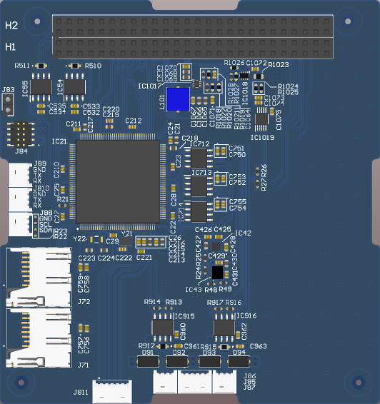
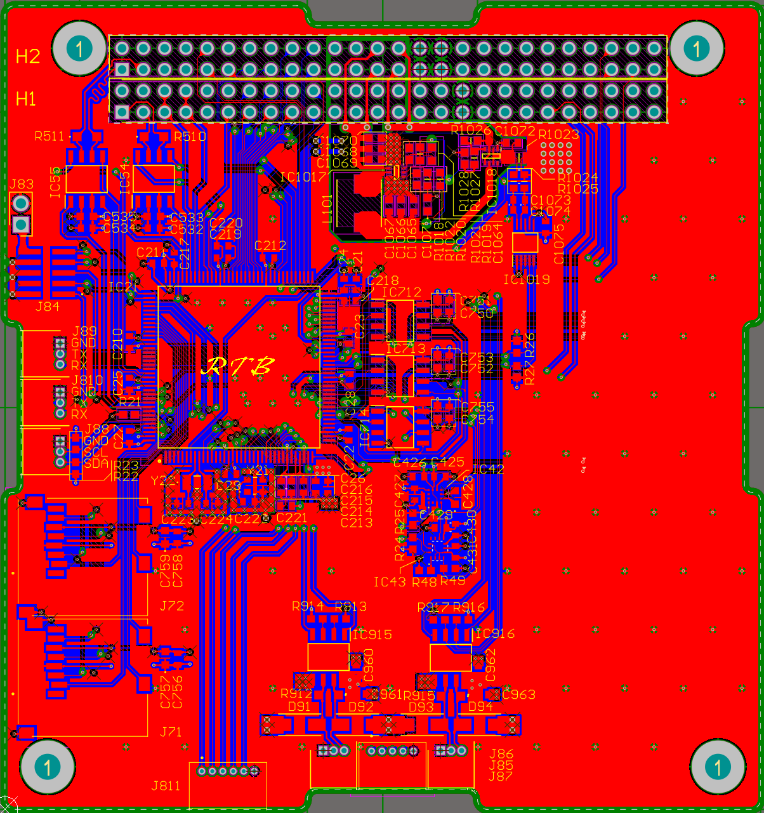

# PC104 Low Cost OBC
This project provides the design of a low-cost On-Board Computer (OBC) tailored for the space sector. It follows the **PC104** form factor, a widely adopted standard in embedded systems, particularly for aerospace applications such as CubeSats and small satellites. The objective of this project is to offer a cost-effective, compact, and reliable computing solution for space-bound missions, with scalability and adaptability for various aerospace applications.

## ✒️ &nbsp; Author 
* **Rubén Torres Bermúdez** - [RubenT17](https://github.com/RubenT17)

##  &nbsp; PCB design

## 🔧 &nbsp; Future Improvements
- Integrate a Sub-GHz transceiver in the available space, enabling communication with ground stations.
- Radiation-hardened version for deep-space applications.

## 📄 &nbsp; License
This project is licensed under the General Public License - see the LICENSE.md file for details

## ❓ &nbsp; Where to ask questions 

| Type                            | Platforms                               |
| ------------------------------- | --------------------------------------- |
| 🚨 **Bug Reports**              | [GitHub Issue Tracker](https://github.com/RubenT17/PC104-M7/issues)                 |
| 🎁 **Feature Requests & Ideas** | [GitHub Issue Tracker](https://github.com/RubenT17/PC104-M7/issues)                 |
